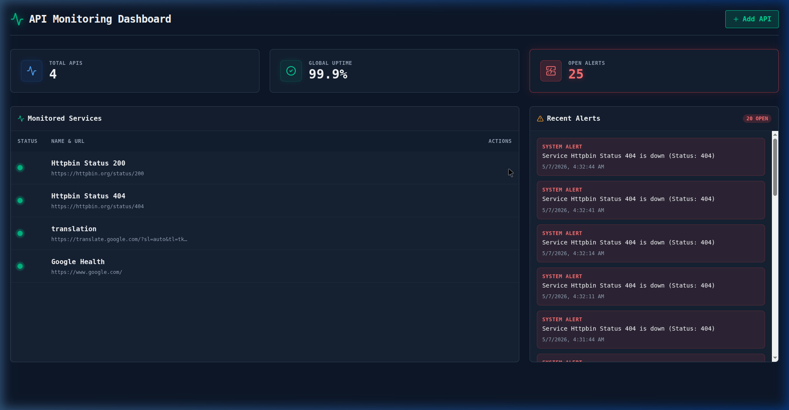
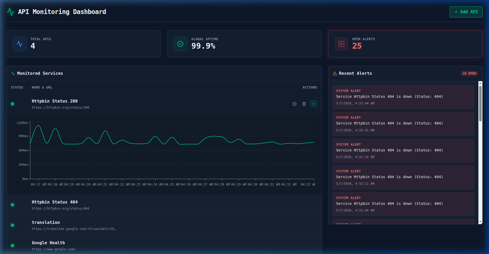

# API Monitoring Dashboard

A real-world DevOps API monitoring solution designed to provide crystal-clear insights into system health. Built with a high-performance **FastAPI** backend and a beautiful, responsive **React + Vite** frontend.


---

## 📸 Screenshots

### Overview Dashboard


### Real-Time Latency Charts


---

## 🚀 Features

* **Advanced Health Checks**: Configure Custom HTTP Methods (GET, POST, PUT, DELETE) and specific expected status codes (e.g. 200, 404).
* **Real-Time Visualizations**: Interactive real-time line charts for tracking API latency, powered by `recharts`.
* **Global Uptime Gauge**: True 24-hour uptime calculation displayed in a sleek semi-circle gauge.
* **Smart Alerting**: Intelligent alerting system that avoids spamming notifications for continuous downtime.
* **Auto-Refresh Controls**: Easily pause and resume dashboard data fetching to investigate issues.
* **Premium UI/UX**: "DevOps vibe" aesthetic featuring Tailwind CSS dark mode (`#0f172a`), emerald accents, glassmorphism, and smooth animations.
* **Auto-Cleanup**: Automated background Celery beat task that prunes ping history older than 7 days.

---

## 🛠️ Architecture

* **Backend (`apulse_api`)**:
  * **Framework**: FastAPI (Python)
  * **Database**: SQLite & SQLAlchemy (Async)
  * **Task Queue**: Celery (Workers & Beat schedule)
  * **Broker**: Redis
* **Frontend (`apulse_dashboard`)**:
  * **Framework**: React + Vite (TypeScript)
  * **Styling**: Tailwind CSS v3
  * **Charts**: Recharts
  * **Icons**: Lucide React

---

## 🏁 Getting Started

### Prerequisites
* **Redis** (Required for Celery background tasks)
* **uv** (Python package manager)
* **Node.js & npm**

### 1. Start Redis
Ensure you have a Redis instance running locally:
```bash
docker run -d -p 6379:6379 redis:alpine
```

### 2. Setup Backend
Navigate to the API folder, sync dependencies, and start the services:
```bash
cd apulse_api
uv sync

# Terminal 1: Start the FastAPI Server
uv run uvicorn app.main:app --reload --port 8002

# Terminal 2: Start the Celery Worker
uv run celery -A app.tasks worker --loglevel=info

# Terminal 3: Start the Celery Beat Scheduler
uv run celery -A app.tasks beat --loglevel=info
```

### 3. Setup Frontend
Navigate to the Dashboard folder, install npm packages, and start the Vite dev server:
```bash
cd apulse_dashboard
npm install
npm run dev
```

### 4. View Dashboard
Open your browser and navigate to:
**[http://localhost:5174](http://localhost:5174)**

Click **+ Add API** to start monitoring your endpoints!
