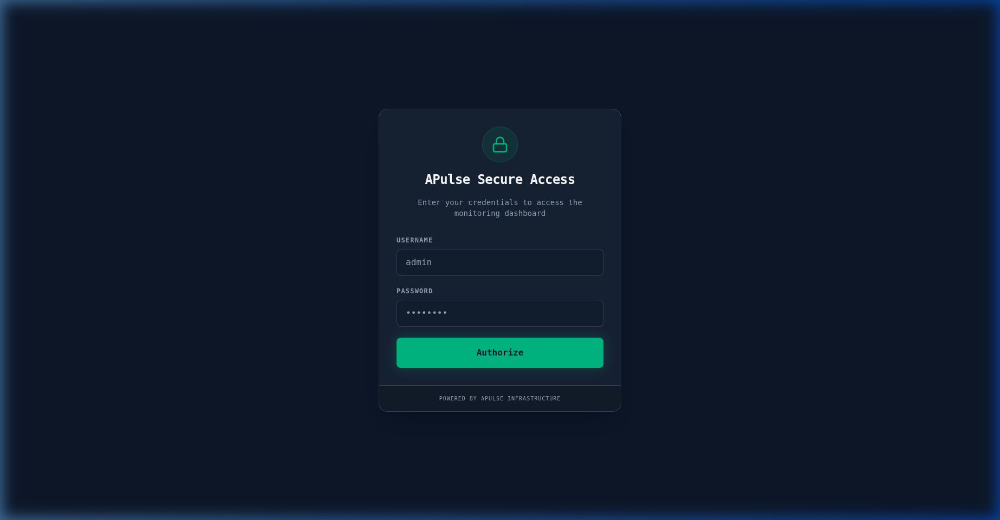
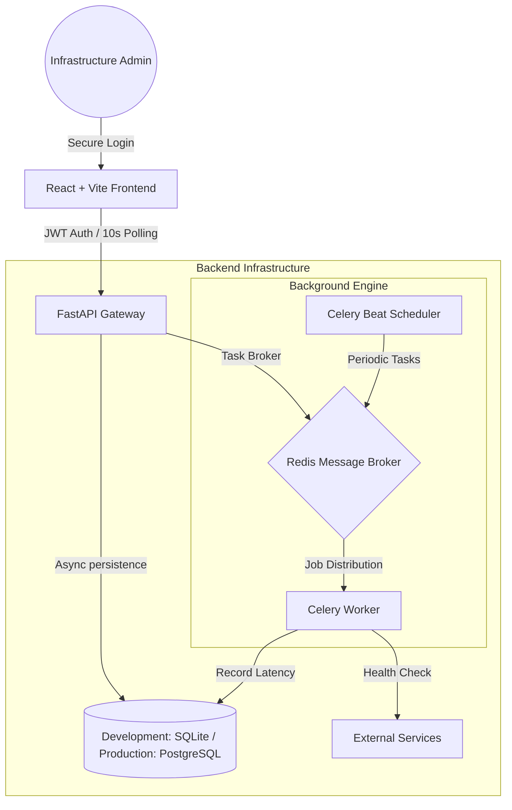

# APulse: Enterprise API Monitoring Dashboard

APulse is a professional-grade, DevOps-themed API monitoring solution designed for real-time visibility into microservices health. It features a distributed architecture using **FastAPI**, **Celery**, and **Redis**, providing a robust system for tracking latency, uptime, and service alerts.


---

## 📸 Visual Overview

### 🔐 Secure Access
Premium JWT-authenticated login portal for secure infrastructure management.


### 📊 Performance Dashboard
Real-time monitoring of service status, global uptime gauge, and active alert feed.


---

## 🚀 Key Features

*   **🛡️ Enterprise Security**: Integrated JWT-based authentication ensuring secure access to infrastructure metrics.
*   **⚙️ Advanced Health Checks**: Support for custom HTTP methods (`GET`, `POST`, `PUT`, `DELETE`) and granular expected status code validation.
*   **📈 Visual Analytics**: Interactive, high-fidelity line charts for response latency tracking powered by `Recharts`.
*   **⏲️ Global Uptime Gauge**: Dynamic calculation of 24-hour aggregate system uptime.
*   **🚨 Intelligent Alerting**: Smart event-driven alerting system designed to prevent notification fatigue by suppressing redundant alerts.
*   **🕹️ Infrastructure Controls**: Live controls to pause/resume monitoring, delete endpoints, and resolve system alerts.
*   **🧹 Automated Maintenance**: Background "Janitor" tasks (Celery Beat) for automated database pruning. Metrics retention policy is fully configurable via schedule intervals.
*   **💎 Modern DevOps UI**: Premium dark-mode interface with glassmorphism effects, built using Tailwind CSS.

---

## 🔗 API Reference

### Authentication
| Endpoint | Method | Description |
| :--- | :--- | :--- |
| `/api/auth/login` | `POST` | Exchange credentials for a JWT Access Token. |

### Service Management
| Endpoint | Method | Description |
| :--- | :--- | :--- |
| `/api/services` | `GET` | List all registered monitors. |
| `/api/services` | `POST` | Create a new service monitor with custom config. |
| `/api/services/{id}` | `PATCH` | Update monitor status (Pause/Resume). |
| `/api/services/{id}` | `DELETE` | Permanently remove a monitor. |

### Metrics & Alerts
| Endpoint | Method | Description |
| :--- | :--- | :--- |
| `/api/services/{id}/metrics`| `GET` | Retrieve historical latency data points. |
| `/api/alerts` | `GET` | Fetch recent system alerts. |
| `/api/alerts/{id}/resolve` | `PATCH` | Mark a specific alert as resolved. |
| `/api/stats` | `GET` | Aggregate system-wide health statistics. |

---

## 🧠 System Architecture



---

## 🏁 Installation & Setup

### Prerequisites
* **Redis**: Required as the distributed task broker.
* **uv**: Modern Python package manager.
* **Node.js & npm**: For the React dashboard.

### 1. External Dependencies
Ensure Redis is running:
```bash
docker run -d -p 6379:6379 redis:alpine
```

### 2. Backend Environment
```bash
cd apulse_api
uv sync

# Terminal 1: API Server
uv run uvicorn app.main:app --reload --port 8002

# Terminal 2: Background Worker
uv run celery -A app.tasks worker --loglevel=info

# Terminal 3: Task Scheduler
uv run celery -A app.tasks beat --loglevel=info
```
> **Auth**: `admin` / `admin123`

### 3. Setup Frontend
```bash
cd apulse_dashboard
npm install
npm run dev
```

---

## ☁️ Deployment Strategy

*   **Production Stack**: Nginx (Reverse Proxy) + Gunicorn/Uvicorn + Docker Compose.
*   **Scalability**: Distributed Celery workers can be scaled horizontally to handle thousands of monitors.
*   **Database Migration**: Built with SQLAlchemy to support seamless migration to PostgreSQL for high-concurrency environments.

---

Professional API Monitoring for Modern DevOps Teams.
